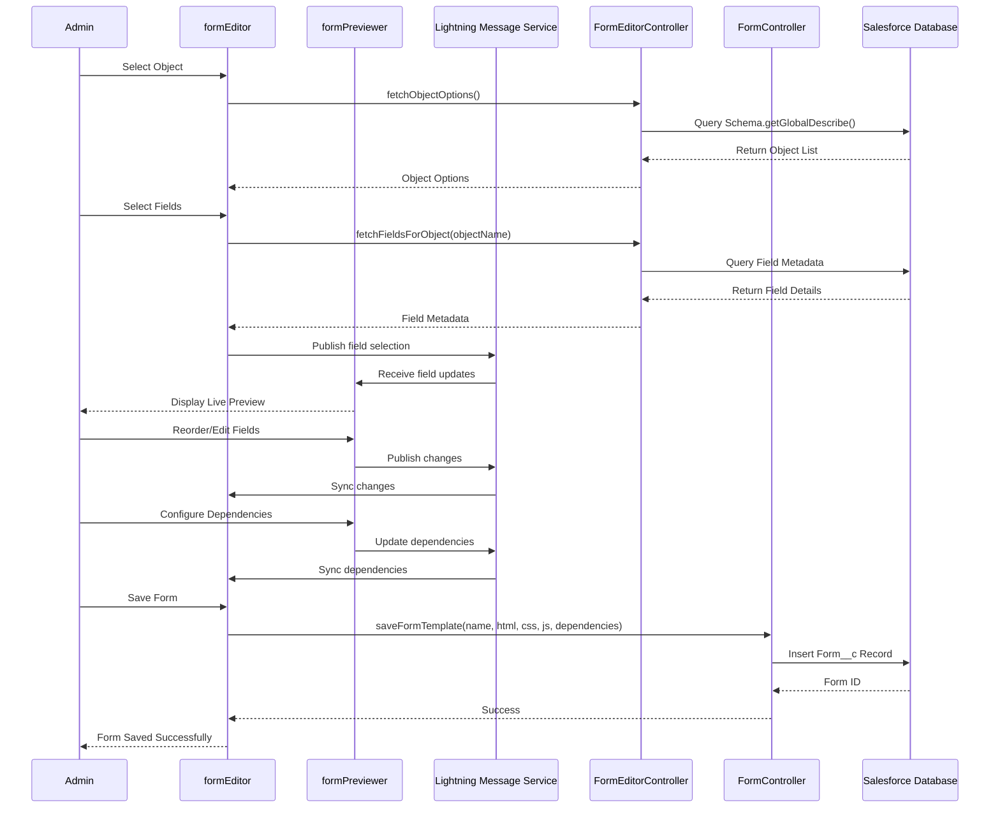
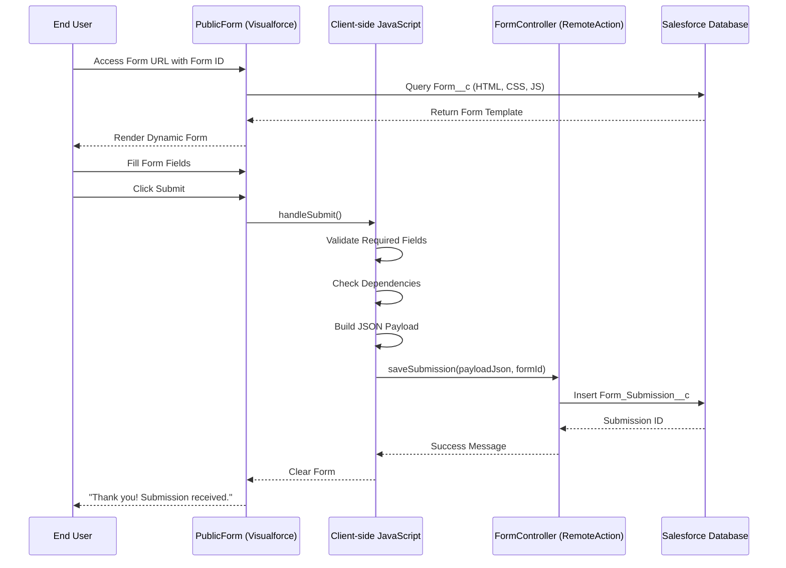
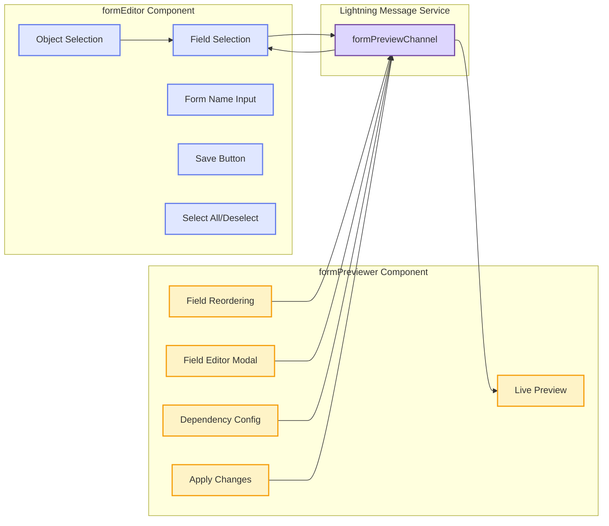
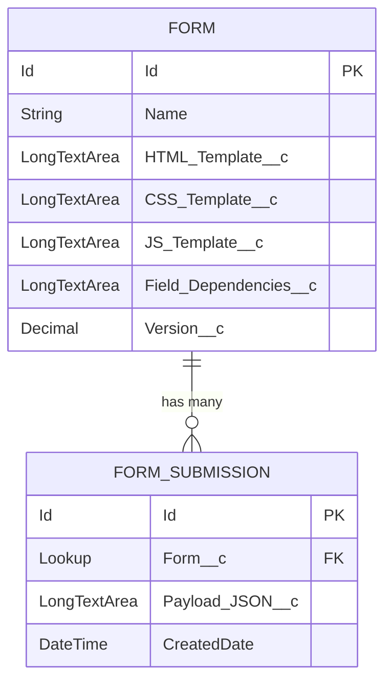
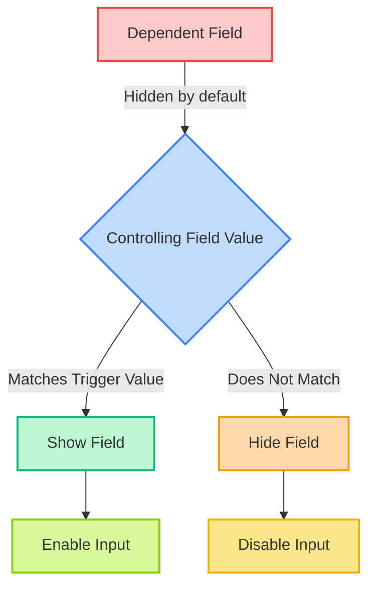
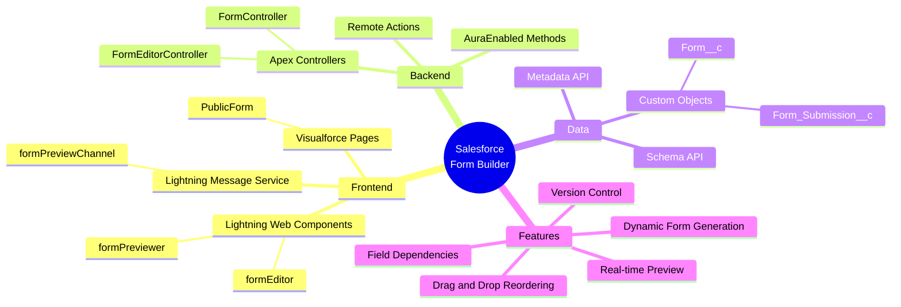
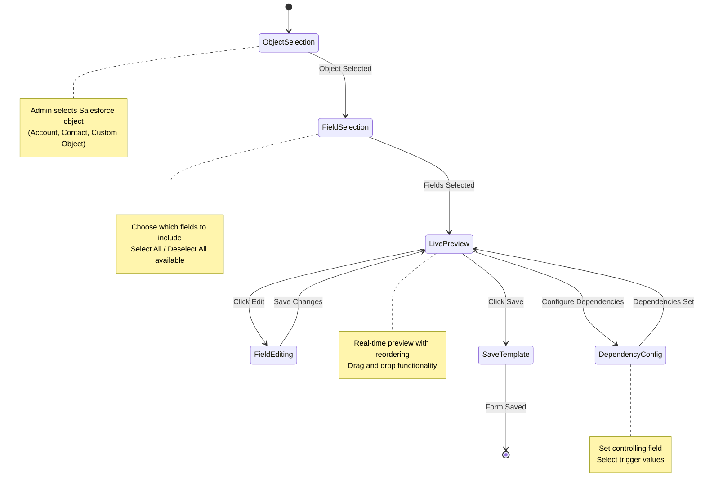

# Salesforce Form Builder - Architecture Documentation

## 🏗️ System Overview

The Salesforce Form Builder is a dynamic form creation and management system that allows administrators to build custom forms by selecting Salesforce objects and fields, configure field dependencies, and deploy public-facing forms for data collection.

---

## 📐 Architecture Layers

```mermaid
graph TB
    subgraph "Frontend Layer"
        FE1[formEditor LWC<br/>Form Builder Interface]
        FE2[formPreviewer LWC<br/>Real-time Preview]
        FE3[PublicForm VF Page<br/>Public Form Display]
        FE4[formPreviewChannel<br/>Lightning Message Service]
    end
    
    subgraph "Backend Layer"
        BE1[FormEditorController<br/>Metadata & Template Management]
        BE2[FormController<br/>Template Save & Submission]
    end
    
    subgraph "Data Layer"
        DL1[(Form__c<br/>Form Templates)]
        DL2[(Form_Submission__c<br/>Form Data)]
    end
    
    FE1 <-->|LMS| FE4
    FE2 <-->|LMS| FE4
    FE1 -->|@AuraEnabled| BE1
    FE2 -->|@AuraEnabled| BE1
    FE1 -->|@AuraEnabled| BE2
    FE3 -->|@RemoteAction| BE2
    BE1 -->|CRUD| DL1
    BE2 -->|CRUD| DL1
    BE2 -->|Insert| DL2
    
    style FE1 fill:#667eea,stroke:#333,stroke-width:2px,color:#fff
    style FE2 fill:#667eea,stroke:#333,stroke-width:2px,color:#fff
    style FE3 fill:#667eea,stroke:#333,stroke-width:2px,color:#fff
    style FE4 fill:#764ba2,stroke:#333,stroke-width:2px,color:#fff
    style BE1 fill:#10b981,stroke:#333,stroke-width:2px,color:#fff
    style BE2 fill:#10b981,stroke:#333,stroke-width:2px,color:#fff
    style DL1 fill:#f59e0b,stroke:#333,stroke-width:2px,color:#fff
    style DL2 fill:#f59e0b,stroke:#333,stroke-width:2px,color:#fff
```

---

## 🔄 Form Creation Flow (Admin)



---

## 📝 Form Submission Flow (End User)



---

## 🎯 Component Architecture



---

## 🗂️ Data Model



---

## 🔐 Field Dependencies System



### Dependency Configuration

```json
{
  "DependentField__c": {
    "controllingField": "Status__c",
    "controllingValues": ["Active", "Pending"]
  }
}
```

When `Status__c` is set to "Active" or "Pending", `DependentField__c` becomes visible.

---

## 📊 Technology Stack



---

## 🚀 Key Features

### 1. **Dynamic Form Generation**
- Automatically generates HTML, CSS, and JavaScript based on selected fields
- Supports multiple field types: text, email, picklist, checkbox, date, etc.

### 2. **Real-time Synchronization**
- Lightning Message Service enables instant communication between editor and previewer
- Changes reflect immediately without page refresh

### 3. **Field Dependencies**
- Configure conditional field visibility based on picklist values
- Supports controlling/dependent field relationships

### 4. **Version Control**
- Automatic versioning system for form templates
- Track changes and updates over time

### 5. **Metadata-Driven**
- Leverages Salesforce Schema API
- Dynamically fetches object and field metadata
- No hardcoding required

---

## 📁 File Structure

```
force-app/main/default/
├── classes/
│   ├── FormEditorController.cls
│   └── FormController.cls
├── lwc/
│   ├── formEditor/
│   │   ├── formEditor.html
│   │   ├── formEditor.js
│   │   └── formEditor.css
│   └── formPreviewer/
│       ├── formPreviewer.html
│       ├── formPreviewer.js
│       └── formPreviewer.css
├── messageChannels/
│   └── formPreviewChannel.messageChannel-meta.xml
└── pages/
    └── PublicForm.page
```

---

## 🔧 API Methods

### FormEditorController

| Method | Type | Purpose |
|--------|------|---------|
| `getFormTemplates()` | @AuraEnabled (cacheable) | Returns list of saved form templates |
| `getFormData(Id formId)` | @AuraEnabled | Retrieves specific form template data |
| `fetchObjectOptions()` | @AuraEnabled (cacheable) | Returns accessible Salesforce objects |
| `fetchFieldsForObject(String objectName)` | @AuraEnabled (cacheable) | Returns field metadata for selected object |
| `updateFormStatus(Form__c form)` | @AuraEnabled | Updates form status |
| `fetchFieldDependencies(Id formId)` | @AuraEnabled (cacheable) | Returns field dependency configuration |

### FormController

| Method | Type | Purpose |
|--------|------|---------|
| `saveFormTemplate(...)` | @AuraEnabled | Saves new form template with versioning |
| `saveSubmission(...)` | @RemoteAction | Processes form submissions from public page |
| `getFormTemplates()` | @AuraEnabled (cacheable) | Returns form template options |

---

## 🎨 User Interface Flow



---

## 🔒 Security Considerations

- **Sharing Rules**: `FormController` uses `without sharing` to allow public form submissions
- **FormEditorController** uses `with sharing` to respect organizational security
- **Field-Level Security**: Checked via `isCreateable()` and `isUpdateable()` in field retrieval
- **Input Validation**: Client-side and server-side validation for required fields

---

## 📈 Future Enhancements

1. **Multi-step Forms**: Support for paginated forms
2. **Conditional Logic**: Advanced visibility rules beyond simple picklist dependencies
3. **Custom Styling**: Theme builder for form appearance
4. **File Upload**: Support for file attachments in forms
5. **Analytics Dashboard**: Form submission statistics and reporting
6. **Email Notifications**: Auto-send emails on form submission

---

## 📝 Usage Example

### Creating a Form

1. Navigate to Form Builder
2. Select Object (e.g., "Contact")
3. Select Fields (FirstName, LastName, Email, Phone)
4. Configure dependencies if needed
5. Preview and reorder fields
6. Click "Save & Generate Form"
7. Share the public form URL with end users

### Submitting a Form

1. End user accesses: `/apex/PublicForm?id={formId}`
2. Fills out the form fields
3. Clicks "Submit"
4. Data is stored in `Form_Submission__c` as JSON

---

## 🐛 Debugging Tips

- Check browser console for JavaScript errors
- Verify Visualforce remoting is loaded: `typeof Visualforce !== 'undefined'`
- Inspect LMS messages: `console.log('Received message:', message)`
- Review Apex debug logs for controller errors
- Validate JSON structure in `Field_Dependencies__c`

---

## 📚 References

- [Lightning Web Components Developer Guide](https://developer.salesforce.com/docs/component-library/documentation/en/lwc)
- [Lightning Message Service](https://developer.salesforce.com/docs/component-library/documentation/en/lwc/lwc.use_message_channel)
- [Visualforce Developer Guide](https://developer.salesforce.com/docs/atlas.en-us.pages.meta/pages/)
- [Apex Developer Guide](https://developer.salesforce.com/docs/atlas.en-us.apexcode.meta/apexcode/)

---

**Version**: 1.0  
**Last Updated**: January 2026  
**Maintained By**: Development Team
